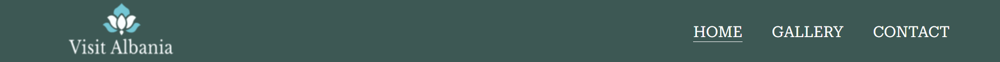

# **Welcome to Albania**

[View live project here.](https://edmir-demaj.github.io/welcome-to-albania/)

**Welcome to Albania** is a site created to present the beautiful nature of this Country. The site target anyone that loves to travel, go for holidays or explore nature. The site contains mostly images rather than text, as we say one image is equal to thousands words. Here users can find information why they should visit Albania, what is so special about this country and some description about food there.

Check out how it looks in different screen sizes:

# **Features**

## **1. Header**
- The header consists of the Logo, Home page, Gallery page and Contact page all with relevant links attached.
- Header is identical in each page for easier navigation.
- Links on Navbar inside the Header change color on hover for better UX.
- The active page has an underline so it is more easy for user to know which page is.
- Fully responsive.

## **2. Hero-image section**
- This section has a large background image where the user will get the first impaction about the site.
- The main welcome message for better understanding what is about the site.
- Call to action button which brings the user to Gallery page where can get a better experience navigating through different images from Albania.
- Text overlay is used to make the user curios to explore more on the site.

## **3. Main content**
- Consists of 3 sections where each one has some text to describe shortly more about the reasons why you should visit Albania.
- On the first section is a video-image so the user can see more about this Country, source from [youtube.](https://www.youtube.com/watch?v=yg9k2uOdciM&t=5s)
- The second and third sections have two different images to give more meaning what they are about and the text to explain more.

## **4. Footer**
- The footer section has links to connect with social media sites and a youtube link where the user can get more information about Albania.
- The footer also has coyrights and Author of the site information.
- Is the same footer in all the pages and all links open to a new tab for easier navigation.

## **5. Gallery page**
- The gallery page provides different images from different places in Albania and each one has a short description.
- Through gallery page user can get more information about Albanian nature.
- Fully responsive page.

## **6. Contact page**
- Contact page consists of two parts:
1. Contac Details, where the users can get details how to reach the organisation who provides information for travelling to Albania.
2. Contact Form, where the users can submit their queries or suggestions they might have about visiting Albania.
- All the fields need to fill out correctly to procced with submitting.

## **Features left to implement**
- I would like to make the site more dynamic with more animations to attract users attention and later to provide backend for my site.

# **Testing**

## **Validator Testing**

- The HTML code is tested on [W3C HTML Validator](https://validator.w3.org/nu/#textarea) and no errors were found.

- The CSS code is tested on [W3C Jigsaw Validator](https://jigsaw.w3.org/css-validator/validator) and no errors were found.

## **LIghthouse Testing**

The site is tested on Lighthouse devtools on Google Chrome to check the performance and accesibility and the results are abowe:

## **Browsers Testing**

The site is checked in different browsers to see if works properly and if is maintained the design and features wanted.

Browsers used and their version:
- Google Chrome version 105.05
- Microsoft Edge version 105.0
- Firefox version 105.0
- Opera version 90.0

## **Unfixed bugs**

There are no unfixed bugs.

# **Technologies used**

- HTML5
- CSS3 
- GITPOD
- GITHUB
- FIGMA

# **Deployment**
- The site was deployed to GitHub pages. The steps to deploy are as follow:
 1. In the GitHub repository welcome-to-albania, navigate to the Settings tab.
 2. Under *General section scroll down and find Pages.
 3. On the branch section select branch to main and save.
 4. Once the main branch has been selected, the page will be automatically refreshed.
 5. After refreshing we will get the deployed link for the site.
 6. To find our page also can go to GitHub repository welcome-to-albania, on section Environments click GitHub-pages and can find the deployment.

 The link of the site can be found here:
 - https://edmir-demaj.github.io/welcome-to-albania/

 # **Credits**

## **Content**

- The content on Home page was taken from different websites related with travelling to Albania. It was edited and recreated by the author of this site. (Edmir Demaj)
- Instructions how to create hamburger menu for small devices was taken from [CSS Hamburger Menu design | NO JAVASCRIPT](https://www.youtube.com/watch?v=kNiic1CaXrQ&t=618s)
- Inspiration about the design of the site was taken from [johnsmilga.com](https://html-css-flexbox-backroads-new-design.netlify.app/)
- Instructions how to create a Readme.md file were taken from [Code-Institute-Solutions/readme-template](https://github.com/Code-Institute-Solutions/readme-template)

 ## **Other sources used for help**

 - [CodeInstitute](https://learn.codeinstitute.net/ci_program/diplomainfullstacksoftwarecommoncurriculum)
 - [W3schools](https://www.w3schools.com/html/default.asp)
 - [MDN web docs](https://developer.mozilla.org/en-US/docs/Learn/Getting_started_with_the_web/HTML_basics)
 - [Stackoverflow](https://stackoverflow.com/)
 - [Youtube](https://www.youtube.com/results?search_query=flexbox+and+grid)
 - [Google](https://www.google.co.uk/)

 ## **Media**

- All the images used for the site were taken from [Unspalsh.](https://unsplash.com/)
- The video-image on Home page was taken from [Youtube](https://www.youtube.com/watch?v=yg9k2uOdciM)
- The logo was made with [Canva.com](https://www.canva.com/design/DAFNWUi8Ar0/ukgdC9kMg6_DThWJ5jdBUA/edit)
- All icons used were taken from [Font Awsome](https://fontawesome.com/)

# **Wireframe**

Wireframe for this site was made using [Figma](https://www.figma.com/) and was created only for Home page for 3 different screen sizes: 
Desktop, Tablet, Mobile.

See the wireframe for this site.

 ## **Thank you !**

