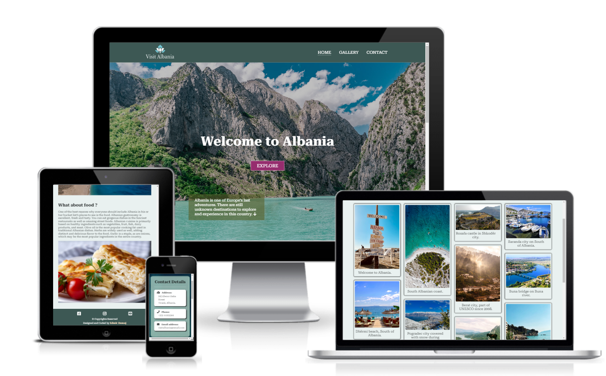

# **Welcome to Albania**

[View the live project here.](https://edmir-demaj.github.io/welcome-to-albania/)

Welcome to Albania is a site that is created to present the beauty of Albania. This site contains mostly images rather than text, as we say one image is equal to thousands words. The site gives information Why you should visit Albania, What is so special, What about food?
Welcome to Albania is a very helpful site for people who would like to travel, have holidays or explore the nature.

Check out how it looks in different devices:

# **Features**

## **1. Header**
- The header consists of the Logo, Home page, Gallery page and Contact page all with relevant links attached.
- Identical in each page for easier navigation.
- Fully responsive.

## **2. Hero-image section**
- This section has a large background image where the user can get the first impaction about the site.
- The main welcome message for better understanding what is about the site.
- Call to action button which brings the user to Gallery page where can get a better experience scrolling through different images from Albania.
- Text overlay to make the user curios to explore more.

## **3. Main section**
- Consists of 3 sections where each one has some text to describe shortly more about the reasons why you should visit Albania.
- On the first section is a video-image from Albania so the user can get more familiar with the Albanian country, source from [youtube.](https://www.youtube.com/watch?v=yg9k2uOdciM&t=5s)
- The second and third have two different images giving meaning what the sections are about and the text explain more.

## **4. Footer**
- The footer section has links to connect with social media sites and a youtube link where the user can get more information about Albania.
- The footer also has coyrights and Author of the site information.
- Is the same footer in all the pages and all links open to a new tab for easier navigation.

## **5. Gallery page**
- The gallery page provides different images from different places in Albania and each one has a short description.
- Through gallery page user can get more information about Albanian nature.
- Fully responsive page.

## **6. Contact page**
- Contact page consists of two parts:
1. Contac Details, where the users can get details how to reach the organisation who provides information for travelling to Albania.
2. Contact Form, where the users can submit their queries or suggestions they might have about visiting Albania.
- All the fields need to fill out correctly to procced with submitting.

## **Features left to implement**
- I would like to make the site more dynamic with more animations to attract users attention and later to provide backend for my site.

# **Testing**

## **Validator Testing**

- The HTML code is tested on [W3C HTML Validator](https://validator.w3.org/nu/#textarea) and no errors were found.

- The CSS code is tested on [W3C Jigsaw Validator](https://jigsaw.w3.org/css-validator/validator) and no errors were found.

## **LIghthouse Testing**

The site is tested on Lighthouse devtools on Google Chrome to check the performance and accesibility and the results are abowe:

## **Browsers Testing**

The site is checked in different browsers to see if works properly and if is maintained the design and features wanted.

Browsers used and their version:
- Google Chrome version 105.05
- Microsoft Edge version 105.0
- Firefox version 105.0
- Opera version 90.0

## **Unfixed bugs**

There are no unfixed bugs.

# **Deployment**
- The site was deployed to GitHub pages. The steps to deploy are as follow:
 1. In the GitHub repository welcome-to-albania, navigate to the Settings tab.
 2. Under *General section scroll down and find Pages.
 3. On the branch section select branch to main and save.
 4. Once the main branch has been selected, the page will be automatically refreshed with a detailed ribbon display to indicate the successful deployment.
